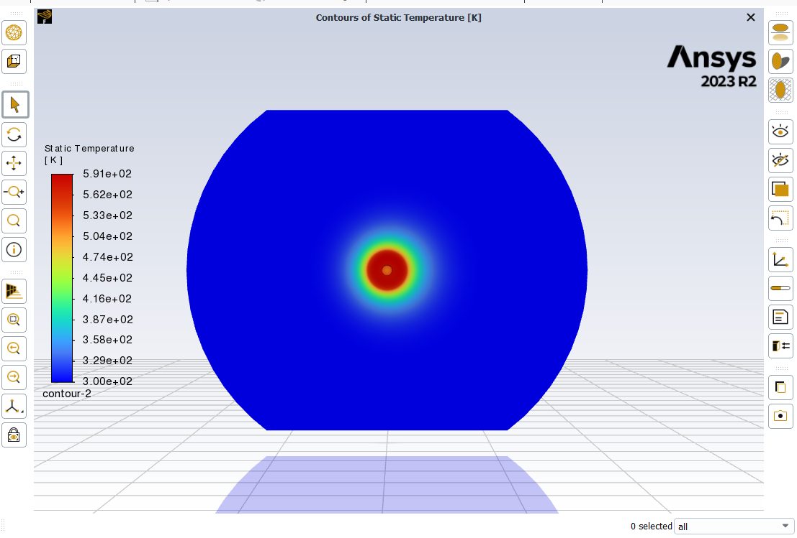
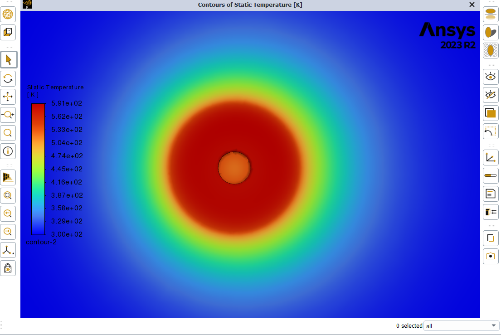
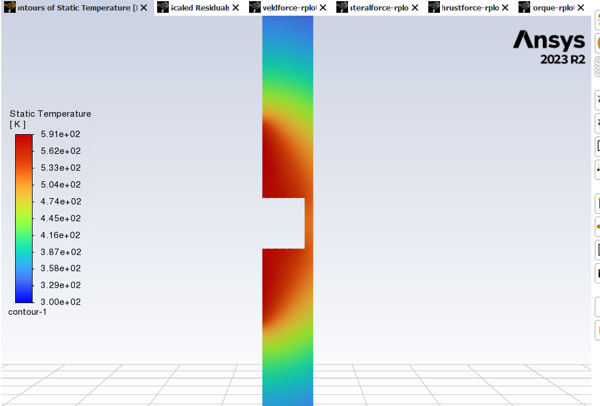
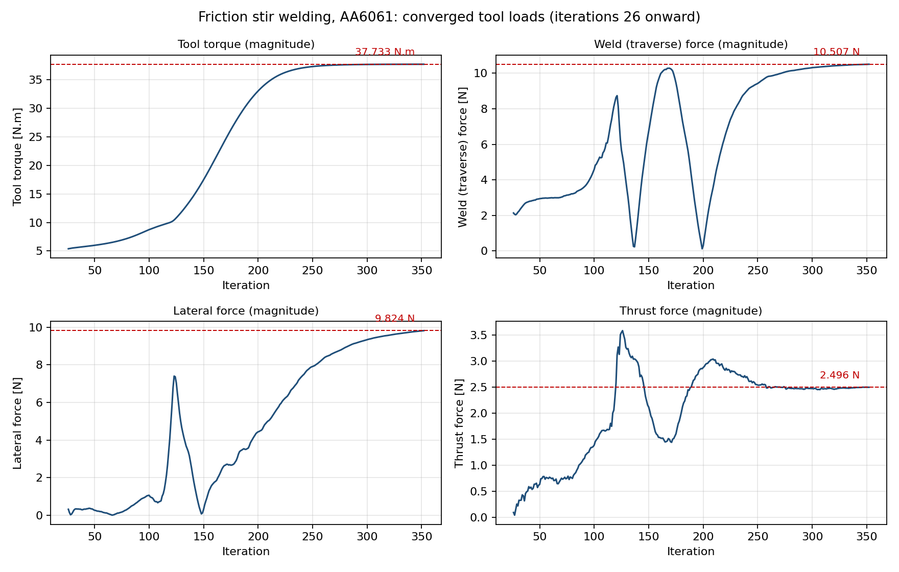

# Weld Temperature and Torque Prediction in Friction Stir Welding

A steady-state CFD model of friction stir welding (FSW) on 6 mm AA6061 plate,
built in Ansys Fluent 2023 R2. The weld is solved as an Eulerian flow of a
highly viscous non-Newtonian fluid past a fixed rotating tool, with all heat
generated by viscous dissipation in the plasticised material.

The model predicts the two quantities a process engineer needs before a weld
trial: the peak temperature in the stir zone, and the torque the spindle has to
supply.

| Predicted quantity | Value |
| --- | --- |
| Peak weld temperature | 591 K (318 C), 0.69 of the AA6061 solidus |
| Tool torque | 37.73 N.m |
| Spindle power (torque x omega) | 2.81 kW |
| Heat input per unit weld length | 2.11 kJ/mm |
| Weld (traverse) force | 10.51 N |
| Lateral force | 9.82 N |
| Thrust force | 2.50 N |

---

## Why model FSW as a fluid

FSW is a solid-state process, so a fluid formulation is not the obvious choice.
It is used here because above roughly 0.7 of the melting point the aluminium in
the stir zone deforms at strain rates high enough that its behaviour is
dominated by rate-dependent flow rather than by elastic response. Treating that
material as an incompressible fluid whose viscosity falls steeply with
temperature and shear rate reproduces the observed material transport around
the pin, and turns an expensive contact-and-large-deformation problem into a
steady flow problem that converges in a few hundred iterations.

The trade is that elastic springback, residual stress and free-surface effects
such as flash are outside the model. Those limits are listed in full below.

---

## Physical setup

**Workpiece.** 240 x 192 x 6 mm AA6061 plate.

**Tool.** 24 mm flat shoulder, 6 mm cylindrical unthreaded pin, 5 mm long into
a 6 mm plate. Shoulder to pin diameter ratio 4:1.

**Process window.**

| Parameter | Value |
| --- | --- |
| Rotation speed | 74.351 rad/s = 710 rpm |
| Traverse speed | 0.00133 m/s = 79.8 mm/min |
| Weld pitch | 8.9 rev/mm |
| Shoulder edge velocity | 0.89 m/s |

**Reference frame.** The tool is held fixed and the plate is convected past it
at the traverse speed. This turns a moving-boundary problem into a steady one:
the inlet, the two free faces and the side walls all translate at 0.00133 m/s,
while the tool wall carries only the rotational velocity.

---

## Material model

AA6061 is defined as a fluid with a shear-rate and temperature dependent
non-Newtonian power law:

```
eta = k * gammadot^(n - 1) * exp(alpha / T)
```

| Property | Method | Value |
| --- | --- | --- |
| Density | constant | 2700 kg/m3 |
| Specific heat | 3rd order polynomial | 929, -0.627, 1.48e-3, -4.33e-8 |
| Thermal conductivity | 3rd order polynomial | 25.2, 0.398, 7.36e-6, -2.52e-7 |
| Viscosity | non-Newtonian power law | k = 6.88e7, n = 0.0421 |
| Viscosity limits | clipped | 1.0e3 to 1.0e6 Pa.s |
| Reference temperature | | 298 K |
| Activation term alpha (E/R) | | 1380 K |

The very low power-law index (n = 0.0421) makes the material strongly shear
thinning, which is what localises deformation into a narrow band around the
pin. In the converged solution the viscosity spans 1.86e3 to 1.00e6 Pa.s, so
the upper clip is active across the cold plate, where it correctly makes the
material behave as effectively rigid, and the lower clip is never reached.

---

## Boundary conditions

| Zone | Type | Condition |
| --- | --- | --- |
| `velocityinlet` | velocity inlet | 0.00133 m/s |
| `pressureoutlet` | pressure outlet | 0 Pa gauge |
| `fswtool` | wall | rotating at 74.351 rad/s, no slip, adiabatic |
| `topface` | wall | translating, convection h = 30 W/m2K |
| `wall-solid` | wall | translating, convection h = 30 W/m2K |
| `buttomface` | wall | translating, convection h = 10000 W/m2K |

The high coefficient on the bottom face represents conduction into the backing
anvil. The tool wall is left adiabatic so that every joule entering the weld
comes from viscous dissipation, which makes the heat generation a prediction of
the model rather than an input to it.

---

## Solver settings

| Setting | Value |
| --- | --- |
| Solver | 3D, steady, pressure-based, coupled |
| Viscous model | Laminar with viscous heating enabled |
| Energy equation | On |
| Pressure-velocity coupling | Coupled, pseudo-transient (global time step) |
| Pressure discretisation | Second order |
| Momentum and energy | Second order upwind |
| Under-relaxation | Energy 0.75, explicit momentum and pressure 0.5 |
| Mesh | 133,592 cells, 274,816 faces, 26,167 nodes |
| Convergence | 352 iterations, continuity residual 4.97e-05 |

Laminar is the correct choice despite the tool speed: with viscosity of order
1e4 Pa.s and a 24 mm length scale, the Reynolds number is far below unity, so
the flow is creeping and no turbulence model applies.

---

## Results

### Temperature field



A near-axisymmetric thermal field centred on the tool. The stir zone reaches
591 K while the plate edges stay at the 300 K ambient.



The close-up shows the steep gradient across roughly one shoulder radius, which
is what sets the width of the heat affected zone.



The through-thickness section shows the pin cavity and confirms that heat
penetrates the full 6 mm plate thickness rather than staying at the shoulder.

### Tool load convergence



Torque and thrust are flat from roughly iteration 260. The traverse and lateral
forces pass through two sign reversals near iterations 140 and 200 as the
recirculation pattern behind the pin reorganises, then settle. The lateral
force is the slowest to converge and is still drifting by well under 1 percent
per 50 iterations at the point the run was stopped.

Regenerate this figure with `python scripts/plot_monitors.py`.

---

## Reproducing the results

### Option A: re-read the solved case, no Fluent licence needed

The Fluent `.cas.h5` and `.dat.h5` files are plain HDF5 containers, so every
number quoted above can be recovered with h5py alone.

```bash
git clone https://github.com/<your-username>/fsw-cfd-fluent.git
cd fsw-cfd-fluent
pip install -r requirements.txt

python scripts/extract_results.py   # mesh, geometry, fields, derived quantities
python scripts/plot_monitors.py     # convergence figure
```

`extract_results.py` also writes `results/summary.json`, which is the machine
readable version of the results table at the top of this README.

### Option B: re-run the solve in Fluent

Requires Ansys Fluent 2023 R2 or later.

1. Open `simulation/FSW.wbpj` in Ansys Workbench.
2. If the project fails to resolve its cells, load the mesh directly from
   `simulation/mesh/FFF.msh` into a new Fluid Flow (Fluent) system.
3. Read `simulation/fluent/FFF-1.cas.h5` for the full setup, or replay
   `simulation/journal/journal1.wbjn` to rebuild the setup from scratch.
4. Initialise and run to convergence. The reference solution converged in 352
   iterations on 4 cores.

---

## Repository layout

```
.
|-- README.md
|-- requirements.txt
|-- docs/
|   |-- model-setup.md              extended setup notes and assumptions
|   `-- fluent-setup-report.xml     raw Fluent settings export
|-- scripts/
|   |-- extract_results.py          reads case/data HDF5, writes summary.json
|   `-- plot_monitors.py            plots torque and force convergence
|-- simulation/
|   |-- FSW.wbpj                    Workbench project file
|   |-- geometry/FFF.agdb           DesignModeler geometry
|   |-- mesh/FFF.msh                portable Fluent mesh
|   |-- fluent/FFF-1.cas.h5         case: setup, materials, BCs
|   |-- fluent/FFF-1-00352.dat.h5   converged solution fields
|   `-- journal/journal1.wbjn       Workbench session journal
`-- results/
    |-- summary.json                generated by extract_results.py
    |-- images/                     Fluent post-processing screenshots
    |-- figures/                    generated plots
    `-- monitors/                   raw torque and force report files
```

---

## Assumptions and limitations

These are stated plainly because they bound what the numbers mean.

1. **Full sticking at the tool interface.** The tool wall uses a no-slip
   condition, so the material is assumed to move exactly with the tool surface.
   Real FSW involves partial slip, and the slip fraction is the single largest
   lever on predicted torque. Torque reported here should be read as an upper
   estimate.

2. **The predicted peak of 591 K is low.** Published peak temperatures for FSW
   of AA6061 typically fall between 400 and 500 C, whereas this model gives
   318 C. The likely cause is the h = 10000 W/m2K sink applied across the whole
   192 x 240 mm bottom face rather than only the anvil contact patch beneath
   the tool, which over-extracts heat. The ratio to solidus (0.69) is the more
   defensible way to quote the result until that boundary condition is
   refined.

3. **Unthreaded cylindrical pin.** No thread features means no thread-driven
   downward material transport, so through-thickness mixing is under-predicted
   and the model cannot say anything about wormhole or root defects.

4. **No free surface.** The top surface is a flat wall, so flash formation and
   shoulder plunge depth effects are absent.

5. **No plunge or dwell phase.** Only the steady traverse portion of the weld
   is modelled. Transient heating during plunge is not captured.

6. **Single operating point.** One combination of rotation and traverse speed
   was run. A parametric sweep over the process window is the natural next
   step and is what would let the model be used for parameter selection rather
   than for a single prediction.

7. **No experimental validation.** Thermocouple or spindle-current data would
   be needed to calibrate the viscosity constants and the anvil heat transfer
   coefficient.

---

## Tools

Ansys Fluent 2023 R2, Ansys DesignModeler, Ansys Meshing, Python (h5py,
NumPy, Matplotlib).

## Licence

MIT. See [LICENSE](LICENSE).
